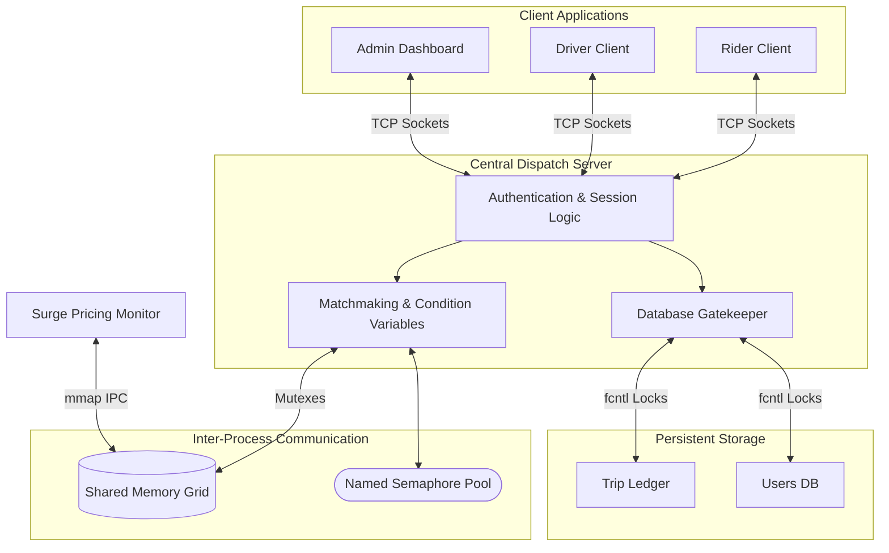

# Concurrent Ride-Sharing Dispatch System


A high-performance, multi-threaded ride-sharing dispatch server (simulating Uber/Ola algorithms) built in C. This system acts as a centralized matchmaker, seamlessly connecting Riders and Drivers in real-time over TCP sockets while maintaining absolute data integrity in a highly concurrent environment.

## 🚀 Key Operating System Concepts Demonstrated

This project serves as a showcase of deep system-level programming and Operating Systems synchronization primitives:

1. **POSIX Condition Variables (`pthread_cond_t`) & Mutexes**: 
   - Eliminates CPU-wasting spinlocks. When a Rider requests a ride, their thread goes to sleep on a Condition Variable. The OS instantly wakes the thread the millisecond the Driver responds, enabling ultra-low latency matchmaking without deadlocks.
2. **True Distributed Socket Architecture (`<sys/socket.h>`)**: 
   - Clients (Riders, Drivers, Admins) never touch the database files. They stream data over custom binary TCP packets. The server parses chunked requests and streams historical ledger data back.
3. **Shared Memory IPC (`shm_open`, `mmap`)**: 
   - The live location grid of drivers is memory-mapped, allowing standalone external processes (like the `surge_calc` monitor) to read the system state at memory-speed without socket overhead.
4. **POSIX Named Semaphores (`sem_open`)**: 
   - Used as an atomic global counter for available drivers. Prevents the server from scanning the memory grid if supply is zero.
5. **Advisory File Locking (`fcntl`)**: 
   - Prevents "Dirty Reads" and "Lost Updates" by enforcing strict Reader-Writer locks (`F_RDLCK` and `F_WRLCK`) on the central trip ledger and user databases.
6. **Thread Safety & Vulnerability Prevention**: 
   - Extensive bounds checking and `snprintf`/`strncpy` usage prevents buffer overflows and segmentation faults on malformed packets. Secure session management prevents descriptor leaks on abrupt disconnects.

## 🧠 System Architecture



## 🛠️ Build and Execution

**Prerequisites:** A POSIX-compliant OS (Linux, macOS, or WSL on Windows) with `gcc` and `make`.

1. **Compile the System:**
   ```bash
   make all
   ```

2. **Start the Central Server:**
   ```bash
   ./bin/server
   ```
   *The server initializes IPC structures (shared memory `/ride_share_shm`) and begins listening on port 8080.*

3. **Start the Surge Pricing Monitor (Optional):**
   ```bash
   ./bin/surge_calc
   ```
   *Run this in a separate terminal to view a live memory-mapped dashboard of driver supply and dynamic pricing adjustments.*

4. **Connect Clients:**
   Open new terminals to simulate users connecting from different machines:
   ```bash
   ./bin/driver   # Login as driver1
   ./bin/rider    # Login as rider1
   ./bin/admin    # Login as admin1
   ```

## 🛡️ Concurrency Safety Mechanisms

- **Deadlock Prevention**: Strict lock ordering is enforced. No nested locking occurs across multiple mutexes (e.g., `session_mutex` and `offers_mutex`).
- **Resource Reclaiming**: Worker threads are spun up using `pthread_detach()` so kernel resources are immediately reclaimed on user logout.
- **Signal Trapping**: `SIGINT` (Ctrl+C) is trapped to ensure graceful unlinking of IPC Shared Memory and Semaphores, preventing ghost resource leaks in the OS.
